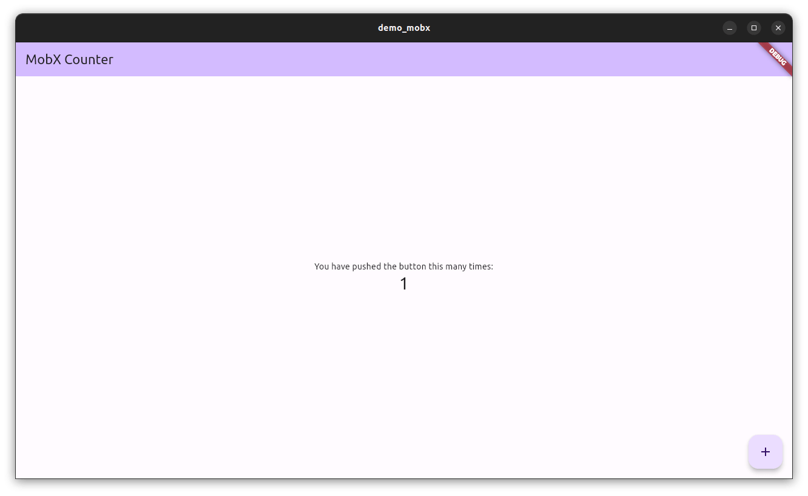

# demo_mobx

- [mobxjs/mobx.dart](https://github.com/mobxjs/mobx.dart)



## Prepare

Create project:

```bash
flutter create demo_mobx
```

Install Dependencies:

```bash
cd demo_mobx
flutter pub add mobx flutter_mobx
flutter pub add -d build_runner mobx_codegen
```

## Create the Store

Create `lib/counter.dart`:

```dart
import 'package:mobx/mobx.dart';

part 'counter.g.dart';

class Counter = _Counter with _$Counter;

abstract class _Counter with Store {
  @observable
  int value = 0;

  @action
  void increment() {
    value++;
  }
}
```

Generate `lib/counter.g.dart`:

```bash
dart run build_runner build

# Stay on watch
dart run build_runner watch
```

## Connect the Widget

Edit `lib/main.dart`:

```dart
import 'package:flutter/material.dart';
import 'package:flutter_mobx/flutter_mobx.dart';

import 'counter.dart'; // Import the Counter

final counter = Counter(); // Instantiate the store

void main() {
  runApp(const MyApp());
}

class MyApp extends StatelessWidget {
  const MyApp({super.key});

  // This widget is the root of your application.
  @override
  Widget build(BuildContext context) {
    return MaterialApp(
      title: 'MobX Demo',
      theme: ThemeData(
        colorScheme: ColorScheme.fromSeed(seedColor: Colors.deepPurple),
        useMaterial3: true,
      ),
      home: const MyHomePage(title: 'MobX Counter'),
    );
  }
}

class MyHomePage extends StatefulWidget {
  const MyHomePage({super.key, required this.title});

  final String title;

  @override
  State<MyHomePage> createState() => _MyHomePageState();
}

class _MyHomePageState extends State<MyHomePage> {
  @override
  Widget build(BuildContext context) {
    return Scaffold(
      appBar: AppBar(
        backgroundColor: Theme.of(context).colorScheme.inversePrimary,
        title: Text(widget.title),
      ),
      body: Center(
        child: Column(
          mainAxisAlignment: MainAxisAlignment.center,
          children: <Widget>[
            const Text(
              'You have pushed the button this many times:',
            ),
            // Wrapping in the Observer will automatically re-render on changes to counter.value
            Observer(
              builder: (_) => Text(
                '${counter.value}',
                style: Theme.of(context).textTheme.headlineMedium,
              ),
            ),
          ],
        ),
      ),
      floatingActionButton: FloatingActionButton(
        onPressed: counter.increment,
        tooltip: 'Increment',
        child: const Icon(Icons.add),
      ),
    );
  }
}
```

## References

- [List of state management approaches](https://docs.flutter.dev/data-and-backend/state-mgmt/options)
- [flutter-boilerplate-project](https://github.com/zubairehman/flutter-boilerplate-project)
