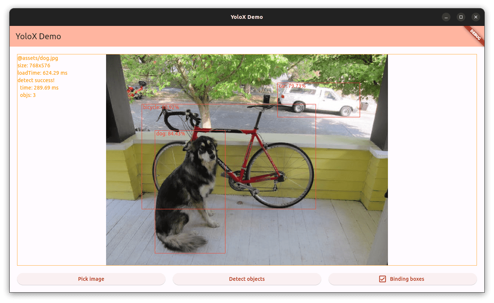
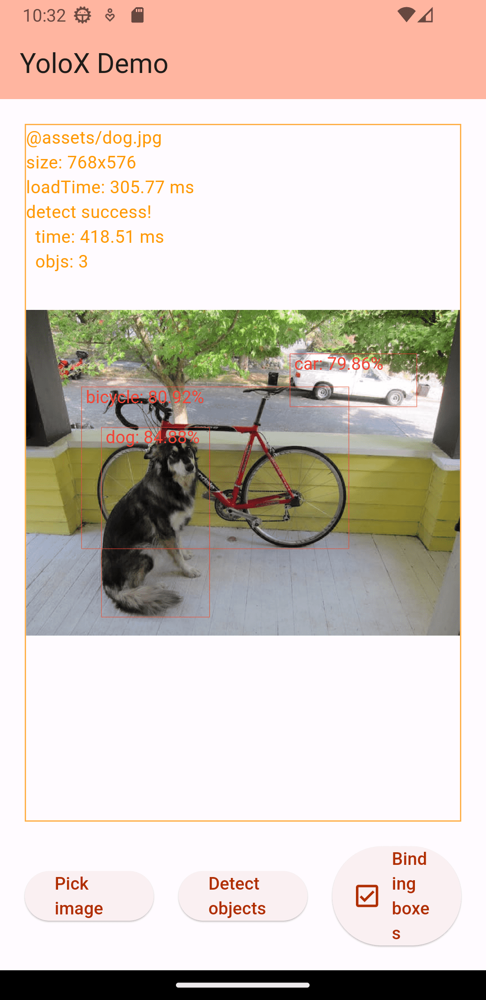

# demo_ncnn

| Linux | Android |
| - | - |
|  |  |

## Prepare

Create project:

```bash
flutter create --project-name demo_ncnn --org dev.flutter --android-language java --ios-language objc --platforms=android,ios,linux demo_ncnn
```

Install deps:

```bash
cd demo_ncnn/

dart pub get

sudo apt-get install libclang-dev
```

Install prebuild binary for plugin, see [plugins/ncnn_yolox/ncnn_yolox.md](../plugins/ncnn_yolox/ncnn_yolox.md).

<!--
dart pub add ffi path logging image easy_debounce
dart pub add -d ffigen

flutter pub add mobx flutter_mobx provider path_provider
flutter pub add -d build_runner mobx_codegen
-->

## Linux

Run app:

```bash
cd demo_ncnn/
flutter run -d linux
```

If wanna rebuild mobx stores,

```bash
dart run build_runner build
```

## Android

Run app:

```bash
cd demo_ncnn/
flutter run
# flutter run --release
```

## References

- [nihui/ncnn-android-yolox](https://github.com/nihui/ncnn-android-yolox)
- [KoheiKanagu/ncnn_yolox_flutter](https://github.com/KoheiKanagu/ncnn_yolox_flutter)
- [tomassasovsky/ncnn.dart](https://github.com/tomassasovsky/ncnn.dart)
